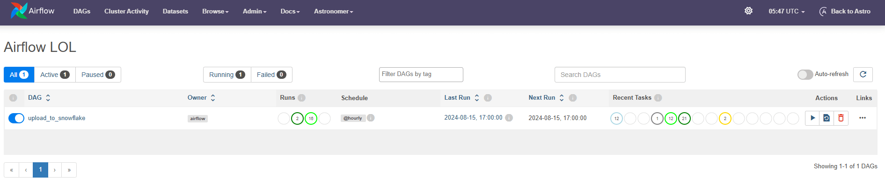
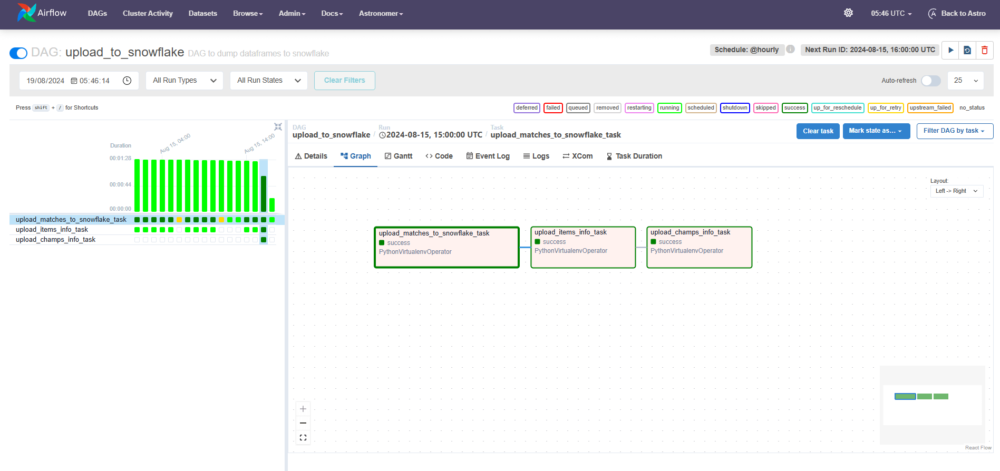
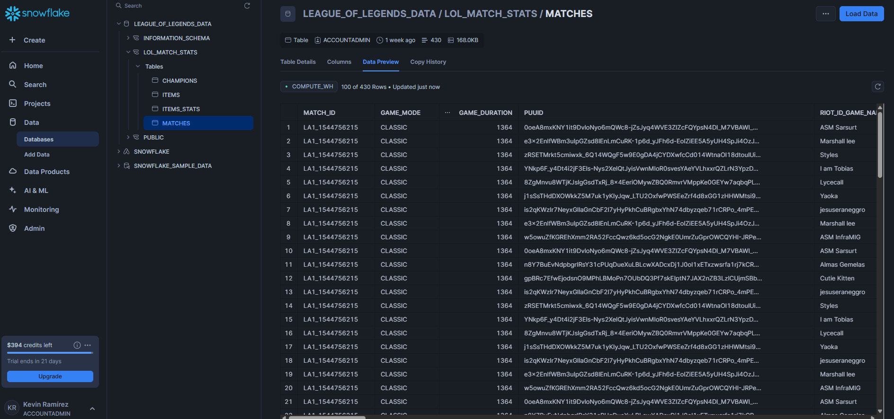
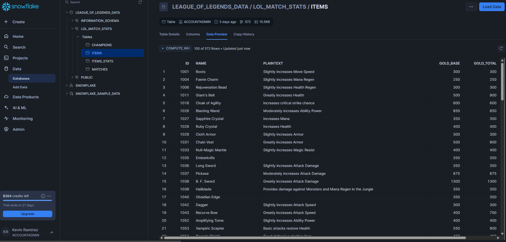
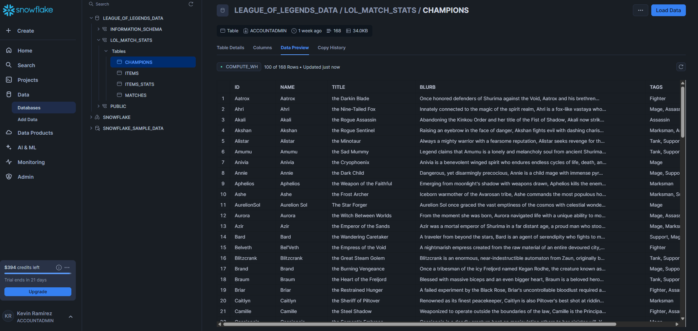
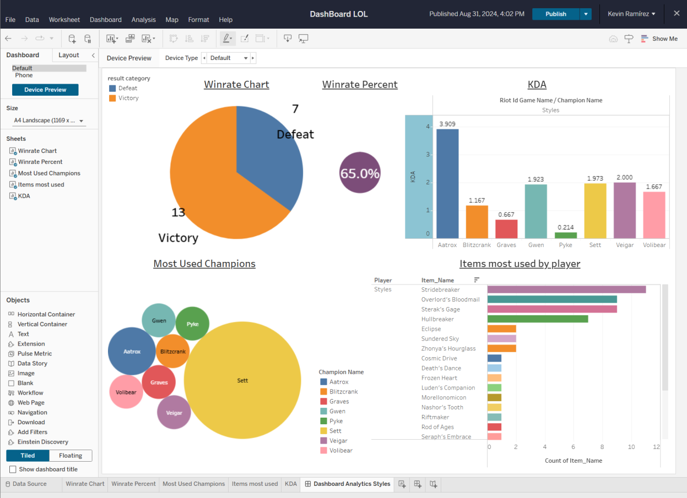

# Description
This project automates the extraction, transformation, and loading (ETL) of League of Legends statistics using Python and SQL. The pipeline is orchestrated with Apache Airflow via Astronomer, and the data is stored in Snowflake for analysis. The process ensures up-to-date, clean data ready for reporting and visualization by means of tableu dashboards.

This project was created for learning purposes. Please note that some resources might not be available in the future, as free trials or limited-time access were used during the development.

## What is League of Legends?

League of Legends (LoL) is one of the most popular video games in the world, generating significant revenue; for instance, in 2020, it earned over $1.75 billion. The game is extremely competitive, featuring battles between two teams of five real players each, where every detail matters—including data. Data plays a crucial role in any field, and LoL is no exception. Players are keenly aware of statistics and percentages that can give them the best possible options in their gameplay.

Given the importance of data, this project aims to explore various data aspects within League of Legends, focusing on a specific player named "Styles." The project analyzes data related to Styles' matches, the champions he uses, the items he purchases in-game, and more. By delving into this data, the project explains valuable insights into the strategic elements of gameplay, helping to understand the impact of choices made during matches.

Through this project, I aim to learn valuable lessons about data analysis and its applications, especially in highly competitive environments like League of Legends. Therefore, the main purpose of this project is to learn as much as possible from different technologies, tools, etc.


## Setup
### **Overview**
This project involves deploying a Python script along with a Directed Acyclic Graph (DAG) to Astronomer. The configuration includes setting up a virtual environment with specific dependencies to ensure the proper execution of the DAG.

### **Prerequisites**
Before setting up the project, ensure you have the following:

- **Docker**: Installed and running. You can download it from the [Docker website](https://www.docker.com/products/docker-desktop).
- **Astronomer CLI**: Installed and configured. You can download it from the [Astronomer website](https://www.astronomer.io/docs/cli).
- **Python 3.8+**: Ensure Python is installed on your system.
- **Airflow**: Make sure Airflow is correctly set up in your Astronomer environment.
- **Tableau**: You can use it Web or installed on your system to visualize the data analysis results. You can download it from the [Tableau website](https://www.tableau.com/).

## Setup Instructions

1. **Clone the Repository**

2. Configure your Astronomer environment. You can do this through the Astronomer by using the Astronomer CLI. Ensure you have set up your Astronomer workspace and project:
    - CLI: Use commands such as astro workspace create, astro project init, and astro dev init to configure your environment. For detailed instructions, refer to the [Astronomer CLI documentation](https://www.astronomer.io/docs/astro/cli/overview).

3. Deploy the DAG to Astronomer
Ensure the DAG file and script are correctly placed in the dags/ directory of your Astronomer project. Then, use the Astronomer CLI to deploy:

```bash
astro deploy
```
   
ℹ️ **Additional Information:** The script code is included within the same Python file as the DAG. This approach was necessary due to the requirement for a separate virtual environment with distinct dependencies to ensure compatibility with the libraries used. To achieve this, I utilized the VirtualenvOperator, which allows for the creation and management of isolated Python environments within Airflow. This setup ensures that all dependencies are properly managed and conflicts are avoided, facilitating a more robust and maintainable workflow.
## DAG code
```python
from airflow import DAG
from airflow.operators.python import PythonVirtualenvOperator
#setting args
default_args = {
    'owner': 'airflow',
    'depends_on_past': False,
    'start_date': datetime(2024, 8, 15),
    'email_on_failure': False,
    'email_on_retry': False,
    'retries': 1,
    'retry_delay': timedelta(minutes=5),
}
#Setting dag
dag = DAG(
    'upload_to_snowflake',
    default_args=default_args,
    description='DAG to dump dataframes to snowflake',
    schedule='@hourly', 
)
#TASKS
upload_task_matches = PythonVirtualenvOperator(
    task_id='upload_matches_to_snowflake_task',
    python_callable=upload_matches_to_snowflake,
    requirements=[
        'requests',
        'sqlalchemy==2.0.31',
        'pandas==2.2.2',
        'snowflake-connector-python==3.11.0',
        'snowflake-sqlalchemy==1.6.1'
    ],
    system_site_packages=True,
    dag=dag,
)
upload_task_items = PythonVirtualenvOperator(
    task_id='upload_items_info_task',
    python_callable=fetch_item_info,
    requirements=[
        'requests',
        'sqlalchemy==2.0.31',
        'pandas==2.2.2',
        'snowflake-connector-python==3.11.0',
        'snowflake-sqlalchemy==1.6.1'
    ],
    system_site_packages=True,
    dag=dag,
)
upload_task_champs = PythonVirtualenvOperator(
    task_id='upload_champs_info_task',
    python_callable=fetch_champs_info,
    requirements=[
        'requests',
        'sqlalchemy==2.0.31',
        'pandas==2.2.2',
        'snowflake-connector-python==3.11.0',
        'snowflake-sqlalchemy==1.6.1'
    ],
    system_site_packages=True,
    dag=dag,
)
#Execution order
upload_task_matches >> upload_task_items >> upload_task_champs
```


This project is ready to be deployed to Astronomer and use Airflow.
Use: "astro deploy" command once you have created an account and connected to Astronomer


## A **DAG** running successfully on Astronomer 




## Tasks executing seamlessly within the Airflow environment.



---


## Data has been successfully loaded into Snowflake and is now being displayed as intended. The data pipeline has effectively ingested the data and the results are visible in the Snowflake environment.
### Matches

### Items

### Champs


### Dashboard using Tableu

## Dashboard Overview
I developed a dashboard by connecting Tableau with Snowflake, where data is kept up to date through the automation of Airflow. This dashboard includes interesting test features that demonstrate the correct functioning of this project. However, once the data is in Tableau, there are many more possibilities for analysis and visualization. This dashboard serves as a small and simple example of what can be achieved.



## Access the Dashboard

If the dashboard is still available when you see this, you can view it directly in Tableau using the following link: [Dashboard Analytics](https://us-east-1.online.tableau.com/t/stylescuentasb9a46c802a/views/DashBoardLOL/Dashboard1/2113e944-6b6f-4869-831c-ea2506b0c715/96dd4e94-f3b1-4fb3-9b5c-12a8c1dd80ae) 


