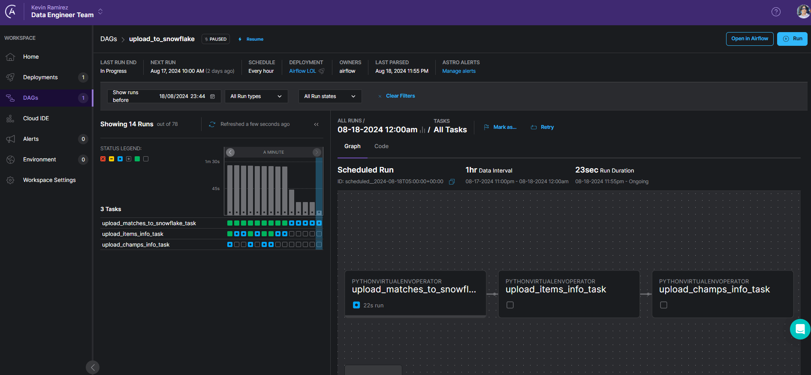

# Data_pipeline_lol
This project automates the extraction, transformation, and loading (ETL) of League of Legends statistics using Python and SQL. The pipeline is orchestrated with Apache Airflow via Astronomer, and the data is stored in Snowflake for analysis. The process ensures up-to-date, clean data ready for reporting and visualization.

This project is ready to be deployed to Astronomer and use Airflow.
Use: "astro deploy" command once you have created an account and connected to Astronomer

## A **DAG** running successfully on Astronomer 

## Tasks executing seamlessly within the Airflow environment.

---

## Data has been successfully loaded into Snowflake and is now being displayed as intended. The data pipeline has effectively ingested the data and the results are visible in the Snowflake environment.
### Matches

### Items

### Champs

